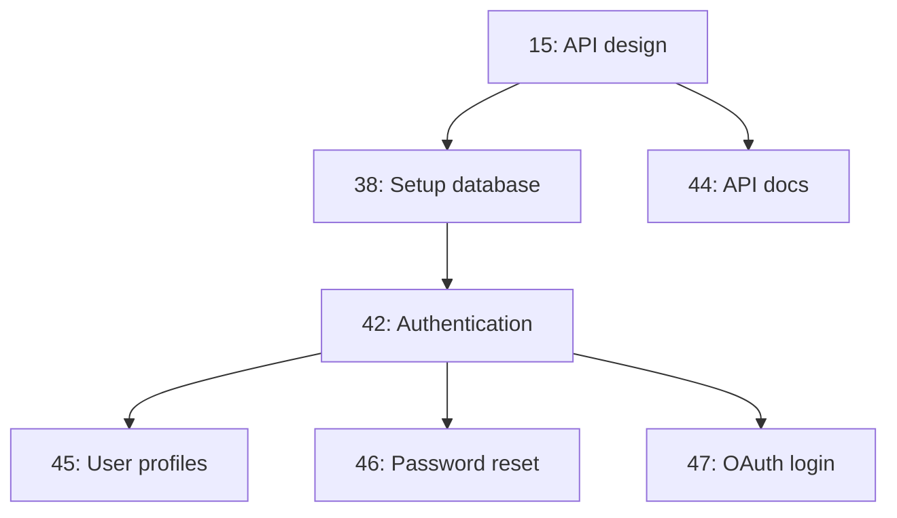

# End-to-End Testing: Agent Workflow with Gitea Robot CLI

## Overview

This document describes the complete end-to-end testing scenario where an AI agent:
1. Registers with the system
2. Creates a project
3. Starts tracking issues
4. Validates priorities by dependencies

All via a CLI that wraps the HTTP API (similar to `bd` for Beads).

## Architecture

```
┌─────────────────────────────────────────────────────────────────┐
│  AGENT (Claude Code, Codex, etc.)                               │
│  ─────────────────────────────────────                          │
│  Calls: gitea-robot triage --owner X --repo Y                   │
│         gitea-robot add-dep --issue 1 --blocks 2                │
│         gitea-robot validate --check-cycles                     │
└─────────────────────────────────────────────────────────────────┘
                            │
                            ▼
┌─────────────────────────────────────────────────────────────────┐
│  gitea-robot CLI (thin HTTP wrapper)                            │
│  ─────────────────────────────────────                          │
│  Subcommands:                                                   │
│  - init          → Setup project, create AGENTS.md              │
│  - triage        → GET /robot/triage                            │
│  - ready         → GET /robot/ready                             │
│  - graph         → GET /robot/graph                             │
│  - add-dep       → POST /repos/{owner}/{repo}/issues/{id}/deps  │
│  - rm-dep        → DELETE /repos/{owner}/{repo}/issues/{id}/deps│
│  - validate      → Check cycles, orphaned issues                │
│  - claim         → Assign issue to agent                        │
└─────────────────────────────────────────────────────────────────┘
                            │
                            ▼
┌─────────────────────────────────────────────────────────────────┐
│  GITEA API (terraphim/gitea fork)                               │
│  ─────────────────────────────────────                          │
│  /api/v1/robot/*                                               │
│  /api/v1/repos/{owner}/{repo}/issues/{id}/dependencies         │
└─────────────────────────────────────────────────────────────────┘
```

## CLI Design: `gitea-robot`

### Installation

```bash
# Download binary
curl -fsSL https://git.terraphim.cloud/terraphim/gitea-robot/releases/latest/download/gitea-robot-linux-amd64 -o /usr/local/bin/gitea-robot
chmod +x /usr/local/bin/gitea-robot

# Or install via go
go install git.terraphim.cloud/terraphim/gitea-robot@latest
```

### Configuration

```bash
# Set environment variables
export GITEA_URL=https://git.terraphim.cloud
export GITEA_TOKEN=your_api_token

# Or use config file
mkdir -p ~/.config/gitea-robot
cat > ~/.config/gitea-robot/config.yaml <<EOF
gitea_url: https://git.terraphim.cloud
gitea_token: your_api_token
default_owner: terraphim
EOF
```

### Commands

#### 1. `init` - Initialize Project

```bash
gitea-robot init --owner terraphim --repo my-project
```

**What it does:**
- Verifies Gitea API access
- Creates `.gitea-robot/` directory
- Generates `AGENTS.md` in project root
- Creates sample issues for testing

**Generated AGENTS.md:**
```markdown
# Agent Instructions for my-project

## Task Tracking

This project uses Gitea Robot for issue dependency tracking and prioritization.

### Available Commands

```bash
# Get prioritized task list
gitea-robot triage

# Get unblocked (ready) tasks
gitea-robot ready

# View dependency graph
gitea-robot graph

# Add dependency: issue 2 blocked by issue 1
gitea-robot add-dep --issue 2 --blocks 1

# Remove dependency
gitea-robot rm-dep --issue 2 --blocks 1

# Validate dependency graph
gitea-robot validate
```

### Workflow

1. **Start of session:** Run `gitea-robot triage` to get prioritized tasks
2. **Pick a task:** Choose from "ready" list (unblocked issues)
3. **Claim it:** `gitea-robot claim --issue <id>`
4. **Work on it:** Implement the feature/fix
5. **Close it:** Mark issue as closed in Gitea
6. **Repeat:** Run `gitea-robot ready` for next task

### Priority System

Issues are ranked by PageRank algorithm considering:
- How many issues depend on this one
- Position in dependency chain
- Open/closed status

Higher PageRank = more important to complete first.
```

#### 2. `triage` - Get Prioritized Tasks

```bash
gitea-robot triage [--owner terraphim] [--repo my-project] [--format json|markdown]
```

**Output (markdown format):**
```markdown
## Triage Report for terraphim/my-project

### Quick Stats
- Total: 12 issues
- Open: 8 issues
- Blocked: 3 issues
- Ready: 5 issues

### Top Recommendations

1. **#42: Implement authentication** (PageRank: 0.85)
   - Unblocks: #45, #46, #47
   - Status: open
   - Command: `gitea-robot claim --issue 42`

2. **#38: Setup database schema** (PageRank: 0.72)
   - Unblocks: #42, #44
   - Status: open
   - Command: `gitea-robot claim --issue 38`

### Blockers to Clear

- **#15: Design API spec** blocks 4 issues
  - Complete this to unblock downstream work

### Project Health
- Cycle detected: No
- Average PageRank: 0.34
```

**Output (json format for agents):**
```json
{
  "quick_ref": {"total": 12, "open": 8, "blocked": 3, "ready": 5},
  "recommendations": [
    {
      "id": 42,
      "index": 42,
      "title": "Implement authentication",
      "pagerank": 0.85,
      "centrality": 0.72,
      "unblocks": [45, 46, 47],
      "claim_command": "gitea-robot claim --issue 42"
    }
  ],
  "blockers_to_clear": [...],
  "project_health": {
    "cycle_detected": false,
    "avg_pagerank": 0.34
  }
}
```

#### 3. `ready` - Get Unblocked Tasks

```bash
gitea-robot ready [--owner terraphim] [--repo my-project]
```

**Output:**
```markdown
## Ready Issues (no open blockers)

1. **#42: Implement authentication** (PageRank: 0.85)
2. **#38: Setup database schema** (PageRank: 0.72)
3. **#29: Write README** (PageRank: 0.15)
4. **#31: Setup CI** (PageRank: 0.12)
5. **#33: Add license** (PageRank: 0.08)
```

#### 4. `add-dep` - Add Dependency

```bash
# Issue 2 is blocked by issue 1
gitea-robot add-dep --issue 2 --blocks 1

# Issue 3 relates to issue 2
gitea-robot add-dep --issue 3 --relates-to 2

# Issue 4 duplicates issue 1
gitea-robot add-dep --issue 4 --duplicates 1

# Issue 5 supersedes issue 3
gitea-robot add-dep --issue 5 --supersedes 3
```

#### 5. `graph` - View Dependency Graph

```bash
gitea-robot graph [--owner terraphim] [--repo my-project] [--format mermaid|json]
```

**Output (mermaid):**
```markdown

```

#### 6. `validate` - Check Graph Health

```bash
gitea-robot validate [--owner terraphim] [--repo my-project]
```

**Output:**
```
✓ No circular dependencies
✓ All dependencies valid
✓ No orphaned issues
✓ PageRank calculated for all issues

Warnings:
- Issue #12 has been open for 30 days with high PageRank (0.75)
```

#### 7. `claim` - Assign Issue to Agent

```bash
gitea-robot claim --issue 42 [--owner terraphim] [--repo my-project]
```

**What it does:**
- Assigns issue to current user
- Adds comment: "Claimed by agent via gitea-robot"
- Updates status to "in_progress" (if using custom status)

## End-to-End Test Scenario

### Test Setup

```bash
#!/bin/bash
# scripts/e2e-test.sh

set -e

export GITEA_URL=http://localhost:3000
export GITEA_TOKEN=test_token

# Create test user and repo
curl -X POST "$GITEA_URL/api/v1/admin/users" \
  -H "Authorization: token $GITEA_TOKEN" \
  -d '{"username":"testagent","email":"test@example.com","password":"testpass"}'

curl -X POST "$GITEA_URL/api/v1/user/repos" \
  -H "Authorization: token $GITEA_TOKEN" \
  -d '{"name":"e2e-test-project","private":false}'

echo "Test environment ready"
```

### Test Steps

#### Step 1: Agent Registration (CLI Init)

```bash
# Agent runs:
gitea-robot init --owner testagent --repo e2e-test-project

# Expected:
# - .gitea-robot/ directory created
# - AGENTS.md created with instructions
# - Success message: "Project initialized for agent tracking"
```

**Validation:**
```bash
test -f AGENTS.md && echo "✓ AGENTS.md created"
test -d .gitea-robot && echo "✓ .gitea-robot directory created"
grep -q "gitea-robot triage" AGENTS.md && echo "✓ Instructions include triage command"
```

#### Step 2: Create Issues (via Gitea API)

```bash
# Create test issues
curl -X POST "$GITEA_URL/api/v1/repos/testagent/e2e-test-project/issues" \
  -H "Authorization: token $GITEA_TOKEN" \
  -d '{"title":"Setup database","body":"Create initial schema"}'
# Returns: Issue #1

curl -X POST "$GITEA_URL/api/v1/repos/testagent/e2e-test-project/issues" \
  -H "Authorization: token $GITEA_TOKEN" \
  -d '{"title":"Implement auth","body":"Add login system"}'
# Returns: Issue #2

curl -X POST "$GITEA_URL/api/v1/repos/testagent/e2e-test-project/issues" \
  -H "Authorization: token $GITEA_TOKEN" \
  -d '{"title":"User profiles","body":"Profile pages"}'
# Returns: Issue #3
```

#### Step 3: Add Dependencies (CLI)

```bash
# Setup: Issue 2 blocked by Issue 1
gitea-robot add-dep --owner testagent --repo e2e-test-project \
  --issue 2 --blocks 1

# Setup: Issue 3 blocked by Issue 2
gitea-robot add-dep --owner testagent --repo e2e-test-project \
  --issue 3 --blocks 2

# Validation: Circular dependency should fail
gitea-robot add-dep --owner testagent --repo e2e-test-project \
  --issue 1 --blocks 3 2>&1 | grep -q "circular" && echo "✓ Circular detection works"
```

#### Step 4: Validate Priority by Dependencies

```bash
# Get triage report
gitea-robot triage --owner testagent --repo e2e-test-project --format json > triage.json

# Validate: Issue 1 should have highest PageRank
# (it's the root of the dependency chain)
HIGHEST_RANK=$(jq -r '.recommendations | max_by(.pagerank) | .index' triage.json)
test "$HIGHEST_RANK" = "1" && echo "✓ Issue 1 has highest PageRank"

# Validate: Issue 3 should be blocked
BLOCKED_COUNT=$(jq -r '.quick_ref.blocked' triage.json)
test "$BLOCKED_COUNT" = "1" && echo "✓ Issue 3 correctly identified as blocked"

# Validate: Only Issue 1 should be ready (unblocked)
READY_COUNT=$(jq -r '.quick_ref.ready' triage.json)
test "$READY_COUNT" = "1" && echo "✓ Only 1 ready issue"
```

#### Step 5: Complete Work and Verify Priority Updates

```bash
# Agent claims Issue 1
gitea-robot claim --owner testagent --repo e2e-test-project --issue 1

# Close Issue 1 (simulating work completion)
curl -X PATCH "$GITEA_URL/api/v1/repos/testagent/e2e-test-project/issues/1" \
  -H "Authorization: token $GITEA_TOKEN" \
  -d '{"state":"closed"}'

# Wait for background PageRank update (or trigger manually)
sleep 5

# Re-run triage
gitea-robot triage --owner testagent --repo e2e-test-project --format json > triage2.json

# Validate: Issue 2 should now be ready and have highest rank
NEW_HIGHEST=$(jq -r '.recommendations | max_by(.pagerank) | .index' triage2.json)
test "$NEW_HIGHEST" = "2" && echo "✓ Issue 2 now has highest PageRank"

NEW_READY=$(jq -r '.quick_ref.ready' triage2.json)
test "$NEW_READY" = "1" && echo "✓ Issue 2 now ready"
```

#### Step 6: Validate Graph Integrity

```bash
gitea-robot validate --owner testagent --repo e2e-test-project

# Expected output:
# ✓ No circular dependencies
# ✓ All dependencies valid
# ✓ PageRank calculated
```

#### Step 7: View Dependency Graph

```bash
gitea-robot graph --owner testagent --repo e2e-test-project --format mermaid

# Expected:
# ```mermaid
# graph TD
#     1[1: Setup database] --> 2[2: Implement auth]
#     2 --> 3[3: User profiles]
# ```
```

### Test Cleanup

```bash
# Delete test repo
curl -X DELETE "$GITEA_URL/api/v1/repos/testagent/e2e-test-project" \
  -H "Authorization: token $GITEA_TOKEN"

# Delete test user
curl -X DELETE "$GITEA_URL/api/v1/admin/users/testagent" \
  -H "Authorization: token $GITEA_TOKEN"

echo "✓ Cleanup complete"
```

## Implementation Priority

### Phase 1: Core CLI (MVP)

1. `triage` - Essential for agent workflow
2. `ready` - Essential for picking tasks
3. `add-dep` - Essential for creating dependencies
4. `init` - Essential for project setup

### Phase 2: Extended Features

5. `graph` - Visualization for debugging
6. `validate` - Health checks
7. `claim` - Assignment tracking
8. `rm-dep` - Dependency management

### Phase 3: Advanced

9. `--format toon` - Token-optimized output (like beads)
10. `--robot-next` - Single top recommendation
11. Webhook integration for real-time updates

## Comparison with Beads

| Feature | Beads (`bd`) | Gitea Robot (`gitea-robot`) |
|---------|--------------|----------------------------|
| Storage | SQLite + JSONL | Gitea database (PostgreSQL/MySQL) |
| CLI | `bd triage` | `gitea-robot triage` |
| Robot mode | `--robot-triage` | `--format json` |
| Dependencies | Native | Via Gitea API |
| PageRank | ✅ | ✅ |
| Web UI | ❌ | ✅ (Gitea native) |
| Multi-user | ❌ | ✅ (Gitea users) |
| Git integration | JSONL in repo | Native Gitea integration |

## Files to Create

```
cmd/gitea-robot/
├── main.go              # CLI entry point
├── commands/
│   ├── init.go          # init command
│   ├── triage.go        # triage command
│   ├── ready.go         # ready command
│   ├── add_dep.go       # add-dep command
│   ├── rm_dep.go        # rm-dep command
│   ├── graph.go         # graph command
│   ├── validate.go      # validate command
│   └── claim.go         # claim command
├── client/
│   └── gitea.go         # HTTP client for Gitea API
└── config/
    └── config.go        # Configuration management

scripts/
└── e2e-test.sh          # End-to-end test script
```

## Acceptance Criteria

- [ ] Agent can run `gitea-robot init` and get working setup
- [ ] Agent can create dependencies via CLI
- [ ] Agent can get prioritized task list via `triage`
- [ ] PageRank correctly calculated based on dependencies
- [ ] Circular dependencies are prevented
- [ ] When issue closed, priorities update automatically
- [ ] All commands support `--format json` for agents
- [ ] E2E test script passes completely

## Related

- Beads CLI: https://github.com/steveyegge/beads
- Gitea Robot API: `docs/ROBOT_CLI_TESTING.md`
- Testing Plan: `testing-plan.md`